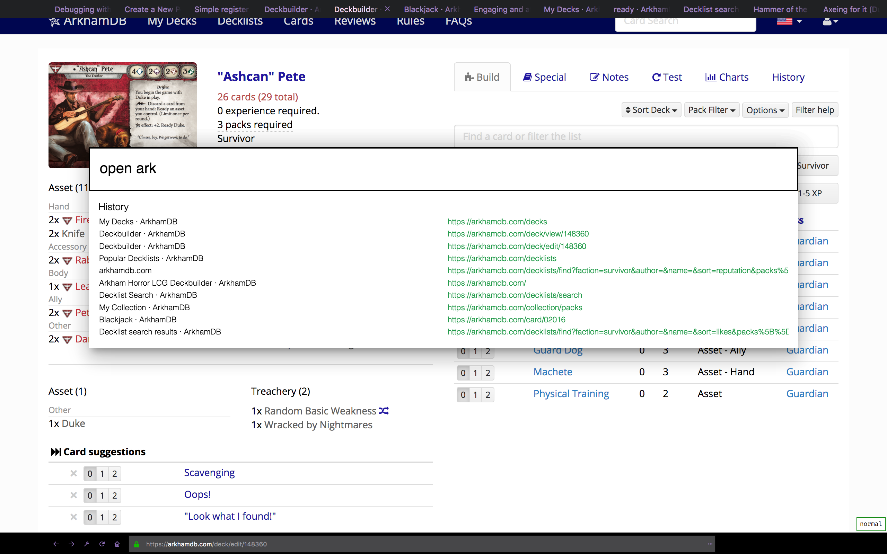

### ⚠️ This project is now part of the official [Tridactyl](https://addons.mozilla.org/en-US/firefox/addon/tridactyl-vim/?src=external-github) extension

I'm still going to continue development on this fork though; scroll down for installation instructions.

# Installation
You can get Shydactyl in one of two ways:

## Official Build
To activate the theme from the Tridactyl command line:
`set theme shydactyl`

## Latest
Follow build instructions [here](https://github.com/cmcaine/tridactyl#building-and-installing)
